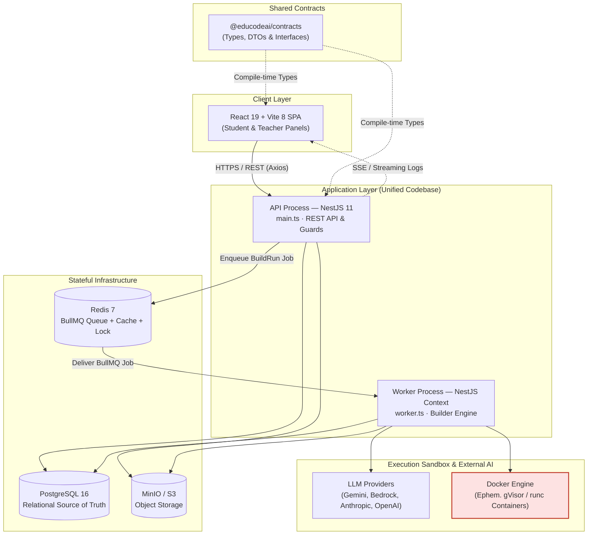
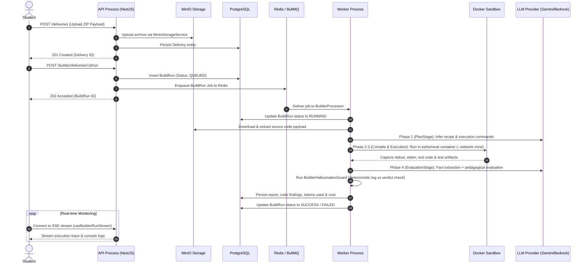
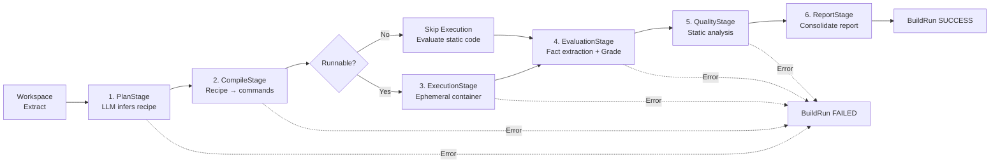

# System Architecture — EduCodeAI

EduCodeAI is an academic platform for the automated evaluation of programming assignments. Teachers configure projects, course groups, and grading guidelines; students submit source code archives; the system executes each submission in an isolated, network-less Docker container, performs static quality analysis, and evaluates code logic with LLM assistance, producing structured pedagogical feedback that a teacher reviews before finalizing marks.

This document serves as the authoritative architectural blueprint for developers and maintainers working on the codebase.

---

## 1. Core Architectural Paradigm

EduCodeAI is built as a **modular monolith in the codebase that deploys as a distributed system of specialized processes**.

The API and the evaluation worker share a single codebase, a single node environment, and a single container image. They differ strictly by their process entry point and dynamic module loading:

- **API Process (`backend/src/main.ts`)**: Boots an HTTP server via `bootstrap.ts` and `api.module.ts`, exposing REST controllers, handling JWT authentication, and serving client requests.
- **Worker Process (`backend/src/worker.ts`)**: Boots a non-HTTP Dependency Injection application context via `bootstrap.ts` and `worker.module.ts`, listening to BullMQ queues on Redis to execute builder jobs.
- **Process Role Selection (`backend/src/process-role.module.ts`)**: Dynamically resolves the root NestJS module graph depending on the environment role (`PROCESS_ROLE=api` vs `PROCESS_ROLE=worker`).

This paradigm delivers the primary benefit of microservices (**independent scaling of API throughput and execution workloads**) without data model fragmentation, distributed transactions, or service discovery overhead.

---

## 2. High-Level Component Topology



---

## 3. End-to-End Execution Flow



---

## 4. Repository Layout & Module Boundaries

### 4.1 Root Directory Map

```text
.
├── backend/                  # NestJS API & Worker codebase
├── frontend/                 # React 19 SPA client
├── shared/contracts/         # @educodeai/contracts (Shared types-only package)
├── audit/                    # Technical audit reports (Phases 01 to 04)
├── prompts/                  # AI System Prompts and evaluation templates
├── docker-compose.yml        # Development & production container orchestration
└── ARCHITECTURE.md           # This document
```

### 4.2 Backend Layering & Hexagonal Design (`backend/src/`)

The backend is structured into self-contained Bounded Contexts under `modules/` and shared infrastructure under `shared/`:

| Module | Responsibility | Invariants |
|---|---|---|
| `auth` | JWT issuance, refresh tokens, `JwtAuthGuard`, `RolesGuard`, Passport strategies | Does not own User entity CRUD |
| `users` | User management, roles (`STUDENT`, `TEACHER`, `ADMIN`), profile management | Does not sign or issue JWTs |
| `academic` | Course groups, enrollments, course assignments | Does not contain grading or project logic |
| `projects` | Projects, rubrics, assignments, deliveries, and the **Builder** submodule | Does not handle user authentication |
| `health` | Liveness (`/health/live`) and Readiness (`/health/readiness`) probes | Contains no business logic |

#### Hexagonal Architecture in `projects/`
Complex modules use a strict Hexagonal split:
- **`presentation/`**: REST controllers and `class-validator` DTOs. Zero business logic.
- **`application/`**: Use-case services orchestrating business workflows.
- **`domain/`**: Pure domain entities, repository interfaces, and value objects.
- **`infrastructure/`**: TypeORM repositories implementing domain interfaces, event listeners, and external adapters.
- **`entities/`**: TypeORM entities mapped to database tables.

### 4.3 Automated Dependency Boundaries (`backend/.dependency-cruiser.cjs`)

Architectural boundaries are strictly enforced via **`dependency-cruiser`** (`npm run boundaries`):

1. **`no-shared-to-modules`**: `src/shared/` must NEVER import from `src/modules/`. (One controlled exception: `admin-seed.service.ts` / `demo-seed.service.ts` for populating demo data).
2. **`no-domain-infra`**: Domain code (`/domain/`) cannot depend on TypeORM or Redis drivers directly.
3. **`no-presentation-infra`**: Controllers (`/presentation/`) must not invoke Docker, MinIO, or LLM services directly; calls must be mediated by application services.

---

## 5. The Builder Engine (Core Evaluation Subsystem)

Located in `backend/src/modules/projects/builder/`, the Builder executes student submissions in isolation.



### Key Engineering Patterns in Builder:
- **Chain-of-Verification (Fact vs. Judgment)**: Phase 1 LLM call extracts verifiable facts from real execution logs without grading. Phase 2 grades *strictly from those extracted facts*.
- **Deterministic Hallucination Guard**: `BuilderHallucinationGuardService` cross-checks LLM assertions against log outputs programmatically without using an LLM.
- **Resilient Multi-Provider LLM Router**: `LlmCircuitBreakerService` routes requests to configured providers (Gemini, Bedrock, Anthropic, OpenAI) with automatic fallback and circuit breaking.
- **Execution Cost Tracking**: Each `BuildRun` measures `inputTokens`, `outputTokens`, and `executionCostUsd` aggregated stage-by-stage.

---

## 6. Data Model & Database Architecture

### 6.1 Entity Hierarchy & Relational Model
```text
User ──> GroupEnrollment ──> CourseGroup
                                │
Project ──> ProjectAssignment ──┘
   │
   └──> Delivery ──> BuildRun ──> [ Events, Findings, Report ]
```

### 6.2 Key Database Policies
- **Strict Unique Active Run Constraint**: A partial unique index `UQ_build_runs_delivery_active` on `deliveryId` WHERE `status IN ('QUEUED','RUNNING')` guarantees atomically at the database level that a delivery cannot have duplicate active runs.
- **Deletion Mechanics**: Soft deletes (`@DeleteDateColumn`) on `users`, `course_groups`, `projects`, `deliveries`, and `storage_objects`. Revocation (`revokedAt`) on enrollments and assignments. Immutable CASCADE deletion for children of `BuildRun`.
- **Database Migrations**: Versioned DDL migrations in `backend/src/shared/infrastructure/database/migrations/` managed via TypeORM CLI (`npm run migration:run`). `synchronize: false` in production.

---

## 7. Security & Isolation Model

Student submission code is treated as **untrusted** and executed under strict multi-layer sandboxing:

1. **Process Isolation**: Code never runs in the API or worker Node.js process.
2. **Network Isolation**: Contenedors execute with `--network none` during compilation and testing.
3. **Capability & Privilege Reduction**: `--cap-drop ALL`, `--read-only` root filesystem, `--pids-limit 100`, non-root user execution (`nobody`).
4. **gVisor / System Call Interception**: Production environments execute containers using gVisor (`runsc`) to sandbox Linux kernel syscalls.
5. **Separate Bind Mounts**: Student code workspace is mounted read-write; teacher test suites are mounted as read-only (`:ro`) outside the student workspace.

---

## 8. Technology Stack Summary

| Layer | Primary Technology |
|---|---|
| **Frontend** | React 19 · Vite 8 · TypeScript · Tailwind CSS · React Router 7 |
| **Backend** | NestJS 11 · TypeScript · TypeORM · Express |
| **Database** | PostgreSQL 16 |
| **Queue & Cache** | Redis 7 · BullMQ 5 · ioredis |
| **Object Storage** | MinIO (S3-compatible API) |
| **AI / LLM** | Google Gemini · AWS Bedrock · Anthropic · OpenAI-compatible |
| **Sandbox** | Docker Engine · `runsc` (gVisor) / `runc` |
| **Runtime** | Node.js 22 LTS |
