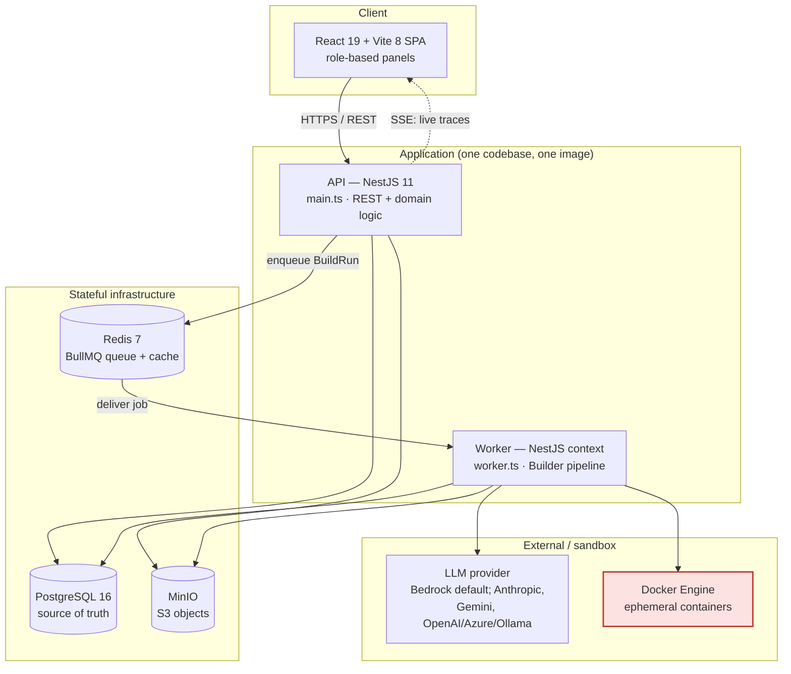
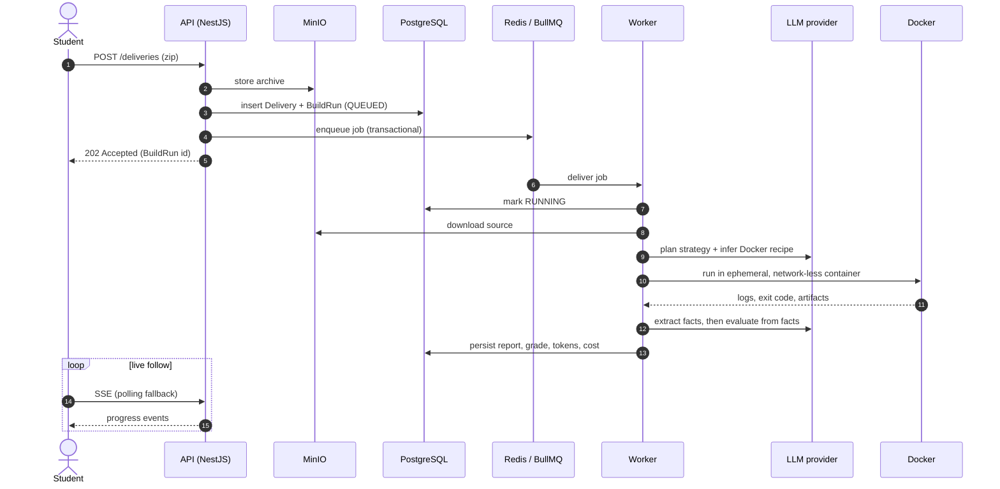

# Architecture

DockUS is an academic platform for the automated evaluation of programming
assignments. Teachers configure projects and grading guidelines; students submit
code; the system runs each submission in an isolated Docker container and grades
it with LLM assistance, producing structured pedagogical feedback that a teacher
reviews before it becomes an official mark.

This document is the map of the system for people working on it. For the deeper
"why" behind each decision, see the per-directory `README.md` files and the
academic write-up under `claude_tfg_fable_v2/`. For an authoritative behavioural
contract and coding rules, see [`CLAUDE.md`](./CLAUDE.md).

## The one thing to understand first

DockUS is a **modular monolith in the code that deploys as a distributed system
of specialised processes**. The API and the worker **share a single codebase and
a single Docker image**; they differ only in their entry point:

- `backend/src/main.ts` → boots an HTTP server (`NestFactory.create`) and exposes
  the REST controllers.
- `backend/src/worker.ts` → boots a DI context with no HTTP port
  (`NestFactory.createApplicationContext`) and registers the BullMQ processor.

This captures the main benefit of microservices — **independent scaling** of the
API and the evaluation worker — without fragmenting the data model, introducing
eventual consistency, or requiring service discovery. The cost is that a fatal
boot error takes down both processes, and the discipline that keeps bounded
contexts from entangling is *conventional*, not enforced by the compiler.

## Component overview



The **SPA never touches infrastructure directly** — every access goes through the
API's REST endpoints. The Docker Engine is the only boundary where untrusted
code runs; it is the subject of the security model below.

## End-to-end data flow



Enqueue is **transactional** and guarded by a **partial unique index** so a
delivery can never have two active runs at once (see *Data model* below).

## Repository layout

```
backend/          NestJS API + worker (modular monolith)
frontend/         React SPA (Vite)
shared/contracts/ @dockus/contracts — types-only package shared by both sides
docker-compose.yml  dev + prod profiles for the whole stack
ai_context/       flattened mirror of every README.md (grep the doc set at once)
graphify-out/     generated code knowledge graph (GRAPH_REPORT.md)
claude_tfg_fable_v2/  academic write-up (design rationale, chapter 4)
```

### Backend (`backend/src/`)

Entry points: `main.ts` (API), `worker.ts` (worker), `bootstrap.ts` (shared HTTP
setup — Helmet, CORS, global `ValidationPipe`, throttler, pino logger).

**Domain modules** (`modules/`), each a self-contained bounded context exporting
one `[Name]Module`:

| Module | Responsibility | Does *not* |
|---|---|---|
| `auth` | JWT issue/refresh, `JwtAuthGuard`, `RolesGuard` | own user CRUD |
| `users` | user identity, roles (`STUDENT`/`TEACHER`/`ADMIN`), soft delete | issue tokens |
| `academic` | course groups, enrollment; publishes domain events | know about projects |
| `projects` | domain hub: assignments, deliveries, storage, **builder** | authenticate |
| `health` | liveness/readiness probes | hold business logic |

`projects/` is large enough to use a **hexagonal split**, one directory per layer:

- `presentation/` — REST controllers + `class-validator` DTOs. No business logic.
- `application/` — use-case services that orchestrate the work.
- `domain/` — repository **interfaces**, types, contracts. **Never imports TypeORM.**
- `infrastructure/` — TypeORM repositories that *implement* the domain interfaces.
- `entities/` — TypeORM entities (a deliberate pragmatic exception to keep the
  dependency rule from doubling every entity with a mapper).

Dependencies always point **toward** the domain; the domain knows nothing about
infrastructure, which is what lets use-case unit tests run with no DB, Docker, or
network.

**Shared kernel** (`shared/`) — cross-cutting infrastructure that domain modules
depend on. Hard rule: **`shared/` never imports from `modules/`** (one-way).

- `config/` — Joi env validation (fail-fast on boot), Redis connection builders.
- `infrastructure/ai/` — LLM generation **router** + provider adapters + prompt registry.
- `infrastructure/docker/` — container/network orchestration via the Docker CLI.
- `infrastructure/storage/` — MinIO/S3 client, signed URLs.
- `infrastructure/queue/` — generic BullMQ abstractions (no domain logic).
- `infrastructure/cache/` — a *separate* fail-fast Redis client for health checks.
- `infrastructure/security/` — throttler policies + AES-256-GCM secret cipher.

> **Two Redis connections, one instance.** BullMQ needs a client that *waits*
> (retry on a blip; never lose a job). Health probes need one that *fails fast*
> (`enableOfflineQueue: false`). These are irreconcilable in one client, so the
> system keeps both. Reuse `buildRedisConnectionOptions` / `buildBullConfig`;
> never hand-roll a connection.

### Frontend (`frontend/src/`)

A role-based SPA organised by domain, not by file type:

- `student/` — the full student flow (workspace, submit, live follow, reports).
- `projects/`, `deliveries/`, `groups/`, `users/`, `storage/`, `runtime/`,
  `summary/` — teacher/admin panels, one per domain.
- `builder/` — the live-run viewer (stage timeline, live console, evaluation,
  evidence panels); real-time via `useBuilderRunStream`.
- `llm/` — the "AI models" admin panel (providers, models, pricing, roles).
- `features/<domain>/` — pure types/constants mirroring backend domains. No React.
- `shared/` — `api/` (the **only** place `axios` lives), `session/`, `workspace/`,
  `toast/`, and `components/ui/` (dumb, business-agnostic design system).

Global state is **Context API only** (session, workspace, toasts) — no
Redux/Zustand. High-frequency state (a running Builder job) is view-local, not
global.

## The Builder pipeline (the core engine)

Lives in `modules/projects/builder/`. It is invoked by `deliveries/` via a queued
job; it does not do project CRUD or permission checks. Key vocabulary: **Trace**
(structured run log), **BuildRun** (one evaluation), **Recipe** (Docker
image + commands + timeouts inferred for a delivery), **Evaluation Contract** (the
strict JSON schema the LLM must return).


- Six **stage handlers** (`application/services/stages/`) implement a common
  interface; a `BuilderPipelineOrchestrator` composes them. Stages never call each
  other and never swallow errors — the orchestrator owns all state transitions and
  is the only one that flips a run to `FAILED`.
- **Evaluation separates facts from judgement** (chain-of-verification): one LLM
  call extracts verifiable facts from the real logs (forbidden to grade), a second
  grades *from those facts*. A deterministic `BuilderHallucinationGuard` (no LLM)
  then cross-checks the verdict against the logs.
- **Prompts live in `domain/ai/` (`prompts.json`), never inline in TS.** Contract
  **parsers** must be defensive: extract JSON from noisy responses, apply defaults,
  and **degrade rather than abort** on unrecoverable output.
- **LLM router** (`shared/infrastructure/ai/`): stages map to roles
  (`planner`/`eval`/`quality`/`chatbot`); each role resolves to a provider
  (Bedrock default, plus Anthropic, Gemini, OpenAI-compatible = OpenAI/Azure/Ollama).
  Configuration is persisted (`llm_configurations`, admin-editable, hot-reloaded)
  with env-var fallback (`BUILDER_BEDROCK_*_MODEL_ID`).
- **Cost per run** is measured and persisted: `BuildRun.inputTokens`,
  `outputTokens`, `executionCostUsd`, aggregated stage-by-stage at each provider's
  tariff.

## Data model highlights

- The academic chain is strictly relational:
  `User → GroupEnrollment → CourseGroup`, and
  `Project → ProjectAssignment → Delivery → BuildRun`. A student submits to an
  **assignment**, not a project directly.
- **Soft delete everywhere** (`@DeleteDateColumn`) + `onDelete: 'RESTRICT'` FKs to
  preserve evaluation evidence.
- **`jsonb`** for what the LLM returns (`BuildRun.report`, `codeQualityFindings`,
  `llmAssessment`) — flexible against evolving contracts. Nothing reaches a `jsonb`
  column without passing a contract parser first.
- **Partial unique index** `UQ_build_runs_delivery_active` on `deliveryId`
  `WHERE status IN ('QUEUED','RUNNING')` — makes "at most one active run per
  delivery" an atomic DB guarantee instead of a racy application check. Finished
  runs are excluded, so re-evaluation is still allowed.
- Provider API keys (`llm_configurations`) are **encrypted at rest** with
  AES-256-GCM; the presentation layer only exposes their last four characters.

## Security & isolation

Student code is **untrusted** and never runs on the host or in the server process.

- **Isolation in layers:** code never runs in the backend process → runs in the
  worker, separate from the network-facing API → gVisor (`runsc`) mediates
  syscalls in production → ephemeral container that is `--network none`,
  `--cap-drop ALL`, `--read-only` root, non-root user (`nobody`), `--pids-limit`,
  CPU/memory caps, `--rm`.
- The **workspace is mounted read-write** (compilation writes artifacts); the
  teacher test suite is a **separate `:ro` bind**, not nested under the student
  workspace.
- **Docker via the CLI** (`child_process.spawn`), not `dockerode` — for real
  process-lifecycle control (kill on timeout), native stream forwarding, and
  fidelity to the security flags. Args are always a **string vector**, never a
  shell-interpreted string.
- **Dependency install is the one networked phase**: dependencies are baked into
  an immutable environment image (hash of base image + system packages + lockfile)
  *without* student code; the code then runs against that image with no network.
- App-level: JWT (short access + long refresh) + RBAC + resource-ownership checks,
  Helmet/CORS, two-bucket rate limiting, global `ValidationPipe`
  (`whitelist` + `forbidNonWhitelisted`), structured pino logs with secrets excluded.
- Raw LLM prompts/responses are **never exposed to the `STUDENT` role** — only the
  final consolidated report.

## Deployment

One `docker-compose.yml` with `dev` and `prod` profiles.

- **dev:** `postgres`, `redis`, `minio`, `backend`, `worker`, `frontend`.
- **prod:** `backend-prod`, `worker-prod`, `frontend-prod` (multi-stage images,
  non-root user, TypeScript/test tooling stripped out).

`backend` and `worker` build from the **same Dockerfile**, differing only in the
start command. Scaling evaluation throughput = replicating the `worker` service.
Stateful services declare healthchecks; app services `depends_on` them with
`condition: service_healthy`. Workspaces live in a `tmpfs` (in-memory, volatile).
The worker has no HTTP port, so its healthcheck is a **file heartbeat**.

**Not handled yet (declared, not implied):** TLS termination (expects a reverse
proxy in front), the Docker socket is mounted by both API and worker (the API only
uses it for the daemon probe — confining it to the worker is pending hardening),
gVisor defaults to `runc` in dev and must be `runsc` in prod, and there are no
spend quotas per user/project.

## Hard architectural boundaries

Enforced by convention across the codebase — do not violate:

1. Frontend never talks to DB/queue/MinIO/LLM directly; only via REST, and all
   HTTP goes through `frontend/src/shared/api/*` (no `axios` elsewhere).
2. Student code only ever runs in an isolated Docker container, never on the host
   or in the server process.
3. Controllers contain no business logic and never orchestrate Docker/MinIO/LLM —
   that belongs in application services.
4. `backend/src/shared/` never imports from `backend/src/modules/**` (one-way).
5. `domain/` never imports TypeORM; prompts never live in `.ts` files.
6. Raw LLM prompts/responses are never exposed to the `STUDENT` role.
7. Frontend global state is Context API only; `shared/components/ui/` stays
   business/API-agnostic.

## Tech stack

| Layer | Technology |
|---|---|
| Frontend | React 19 · Vite 8 · TypeScript · Tailwind CSS · React Router 7 |
| Backend | NestJS 11 · TypeScript · TypeORM |
| Database | PostgreSQL 16 |
| Queue / cache | Redis 7 · BullMQ 5 |
| Object storage | MinIO (S3-compatible) |
| LLM inference | AWS Bedrock (default) · Anthropic · Gemini · OpenAI-compatible (OpenAI/Azure/Ollama) |
| Sandbox | Docker CLI (`spawn`) · `runc` / `runsc` (gVisor) |
| Runtime | Node 22 |

