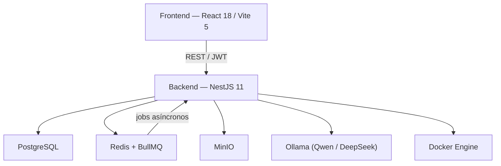

# DockUS

Plataforma académica de evaluación automática de proyectos de programación. Permite a profesores crear proyectos, asignar estudiantes, recibir entregas y obtener informes de evaluación generados mediante un pipeline LLM que combina análisis estático, ejecución aislada en Docker y evaluación con modelos de lenguaje locales (Ollama).

## Arquitectura de alto nivel



## Componentes del repositorio

| Componente | Descripción |
|-----------|-------------|
| [`backend/`](./backend/README.md) | API NestJS: dominio académico, pipeline builder, colas BullMQ, almacenamiento MinIO |
| [`frontend/`](./frontend/README.md) | SPA React: consola de trabajo para profesorado, administración y alumnado |
| [`docker-compose.yml`](./docker-compose.yml) | Stack local completo para desarrollo |
| [`docker-compose.gpu.yml`](./docker-compose.gpu.yml) | Override para aceleración GPU (NVIDIA) en Ollama |
| [`.github/workflows/`](./.github/workflows/) | CI: build y tests de frontend y backend |

## Requisitos

| Requisito | Versión mínima |
|-----------|---------------|
| Docker + docker compose | Reciente estable |
| Node.js (desarrollo fuera de Docker) | 22 |
| npm | 10+ |

Para usar el builder fuera de Docker Compose se necesita además: Docker daemon accesible, `python3`, `pip`, `ruff` y `bandit`.

## Inicio rápido

```bash
# 1. Configurar entorno
cp .env.example .env

# 2. Levantar el stack completo
docker compose up --build
```

| Servicio | URL |
|---------|-----|
| Frontend | http://localhost:5173 |
| Backend API | http://localhost:3000/api |
| Swagger UI | http://localhost:3000/api/docs |
| MinIO Console | http://localhost:9001 |
| Ollama | http://localhost:11435 |

> La primera subida puede tardar varios minutos: `ollama-bootstrap` descarga el modelo base y genera los modelos derivados de planificación y evaluación.

### Aceleración GPU (NVIDIA)

```bash
docker compose -f docker-compose.yml -f docker-compose.gpu.yml up --build
```

Requiere drivers NVIDIA, `nvidia-smi` operativo y NVIDIA Container Toolkit instalado para Docker.

## Ejecución en desarrollo (sin Docker)

```bash
# Backend
cd backend && npm install && npm run start:dev

# Frontend (en otra terminal)
cd frontend && npm install && npm run dev
```

Asegúrate de que PostgreSQL, Redis, MinIO y Ollama estén disponibles y alineados con las variables del `.env`.

## Verificación

```bash
cd backend  && npm run build
cd backend  && npm test -- --runInBand
cd frontend && npm run build
```

Si aparecen errores `EACCES` sobre `backend/dist` al ejecutar fuera de Docker tras haberlo ejecutado dentro, elimina los artefactos generados por los contenedores:

```bash
docker compose down
rm -rf backend/dist backend/compiled-output backend/compiled backend/build
```

## Flujo principal

```
Profesor crea proyecto  →  Asigna estudiantes  →  Sube suite de tests
        ↓
Alumno sube entrega (ZIP)
        ↓
Profesor / Alumno lanza BuildRun
        ↓
Pipeline builder (asíncrono, BullMQ):
  1. Planificación LLM   — analiza código, infiere receta Docker
  2. Ejecución Docker    — instala dependencias, lanza tests
  3. Evaluación LLM      — genera informe con nota recomendada
  4. Calidad de código   — ruff, bandit + análisis LLM
        ↓
Informe pedagógico disponible en el panel de entregas
```

## CI

El workflow valida en cada push:

- **frontend**: `npm ci` + `npm run build`
- **backend**: `npm ci` + `npm run build` + `npm test -- --runInBand`

## Estructura del repositorio

```
DockUS/
├── backend/                # API NestJS y pipeline builder
├── frontend/               # SPA React/Vite
├── fixtures/               # Proyectos de ejemplo para tests
├── .github/workflows/      # Pipelines de CI
├── docker-compose.yml      # Stack local completo
├── docker-compose.gpu.yml  # Override GPU para Ollama
└── .env.example            # Plantilla de configuración
```

## Notas

- El backend aplica el prefijo global `/api` a todos los endpoints.
- Swagger (`/api/docs`) solo se expone fuera de producción.
- El builder está optimizado para proyectos Python; soporte para C y Node.js en curso.
- Los informes finales se obtienen desde el detalle del `BuildRun`; no existe un endpoint de informe independiente.
- En producción se recomienda `BUILDER_DOCKER_RUNTIME=runsc` (gVisor) para mayor aislamiento.
