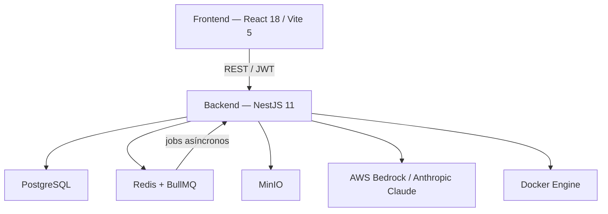

# DockUS

Plataforma académica de evaluación automática de proyectos de programación. Permite a profesores crear proyectos, asignar estudiantes, recibir entregas y obtener informes de evaluación generados mediante un pipeline LLM que combina análisis estático, ejecución aislada en Docker y evaluación con modelos de lenguaje.

> **Estado actual del stack LLM:** el backend usa exclusivamente **AWS Bedrock Runtime** (modelos Anthropic Claude). Ollama y los scripts asociados fueron eliminados del repositorio.

## Arquitectura de alto nivel



## Componentes del repositorio

| Componente                                            | Descripción                                                                         |
| ----------------------------------------------------- | ----------------------------------------------------------------------------------- |
| [`backend/`](./backend/README.md)                     | API NestJS: dominio académico, pipeline builder, colas BullMQ, almacenamiento MinIO |
| [`frontend/`](./frontend/README.md)                   | SPA React: consola de trabajo para profesorado, administración y alumnado           |
| [`docs/`](./docs/README.md)                           | Documentación detallada de arquitectura (backend, frontend, diagramas)              |
| [`academic_proyects/`](./academic_proyects/README.md) | Proyectos académicos de demostración con enunciados y entradas                      |
| [`docker-compose.yml`](./docker-compose.yml)          | Stack local completo para desarrollo                                                |
| [`.github/workflows/`](./.github/workflows/)          | CI: build y tests de frontend y backend                                             |
| [`.agents/`](./.agents/README.md)                     | Configuración y skills para agentes de IA                                           |
| [`graphify-out/`](./graphify-out/GRAPH_REPORT.md)     | Grafo de conocimiento del código (actualizado con `graphify update .`)              |

## Requisitos

| Requisito                            | Versión mínima   |
| ------------------------------------ | ---------------- |
| Docker + docker compose              | Reciente estable |
| Node.js (desarrollo fuera de Docker) | 22               |
| npm                                  | 10+              |

Para usar el builder fuera de Docker Compose se necesita además: Docker daemon accesible y `python3`.

## Inicio rápido

```bash
# 1. Configurar entorno
cp .env.example .env

# 2. Levantar el stack de desarrollo
docker compose --profile dev up --build

# 3. Levantar el stack de producción (imágenes optimizadas)
#    Requiere que el GID del grupo docker del host esté disponible:
#    DOCKER_HOST_GID=$(stat -c '%g' /var/run/docker.sock) docker compose --profile prod up --build -d
```

| Servicio      | URL                            | Perfil |
| ------------- | ------------------------------ | ------ |
| Frontend      | http://localhost:5173          | dev    |
| Backend API   | http://localhost:3000/api      | dev    |
| Swagger UI    | http://localhost:3000/api/docs | dev    |
| MinIO Console | http://localhost:9001          | base   |
| Frontend prod | http://localhost:8080          | prod   |
| Backend prod  | http://localhost:3000/api      | prod   |

> Asegúrate de configurar las credenciales de AWS Bedrock en `.env` si quieres usar el pipeline LLM. Sin ellas, el builder fallará en la etapa de planificación.

## Ejecución en desarrollo (sin Docker)

```bash
# Backend
cd backend && npm install && npm run start:dev

# Frontend (en otra terminal)
cd frontend && npm install && npm run dev
```

Asegúrate de que PostgreSQL, Redis, MinIO y AWS Bedrock estén disponibles y alineados con las variables del `.env`.

## Verificación

```bash
cd backend  && npm run build
cd backend  && npm test -- --runInBand
cd frontend && npm run build
```

Si aparecen errores `EACCES` sobre `backend/dist` al ejecutar fuera de Docker tras haberlo ejecutado dentro, elimina los artefactos generados por los contenedores:

```bash
docker compose down
rm -rf backend/dist backend/compiled-output backend/compiled backend/build
```

## Flujo principal

```
Profesor crea proyecto  →  Asigna estudiantes  →  Sube suite de tests
        ↓
Alumno sube entrega (ZIP)
        ↓
Profesor / Alumno lanza BuildRun
        ↓
Pipeline builder (asíncrono, BullMQ):
  1. Planificación LLM   — analiza código, infiere receta Docker
  2. Ejecución Docker    — instala dependencias, lanza tests
  3. Evaluación LLM      — genera informe con nota recomendada
  4. Calidad de código   — análisis LLM
        ↓
Informe pedagógico disponible en el panel de entregas
```

## CI

El workflow valida en cada push:

- **frontend**: `npm ci` + `npm run lint` + `npm run typecheck` + `npm run build` + `npm test`
- **backend**: `npm ci` + `npm run lint` + `npm run typecheck` + `npm run build` + `npm test -- --runInBand`

## Estructura del repositorio

```
DockUS/
├── backend/                # API NestJS y pipeline builder
├── frontend/               # SPA React/Vite
├── docs/                   # Documentación de arquitectura
├── academic_proyects/      # Proyectos académicos de demostración
├── .agents/                # Configuración de agentes IA
├── .github/workflows/      # Pipelines de CI
├── docker-compose.yml      # Stack local completo
└── .env.example            # Plantilla de configuración
```

## Notas

- El backend aplica el prefijo global `/api` a todos los endpoints.
- Swagger (`/api/docs`) solo se expone fuera de producción.
- El builder soporta proyectos Python y C; el soporte para Node.js está en curso.
- Los informes finales se obtienen desde el detalle del `BuildRun`; no existe un endpoint de informe independiente.
- En producción se recomienda `BUILDER_DOCKER_RUNTIME=runsc` (gVisor) para mayor aislamiento.
- El servicio `backend-prod` corre como usuario no-root y necesita pertenecer al grupo Docker del host para usar el socket montado. Antes de levantarlo, exporta `DOCKER_HOST_GID` con el GID del socket (p. ej. `DOCKER_HOST_GID=$(stat -c '%g' /var/run/docker.sock)`).
- Después de modificar código, ejecuta `graphify update .` para mantener el grafo de conocimiento actualizado.
