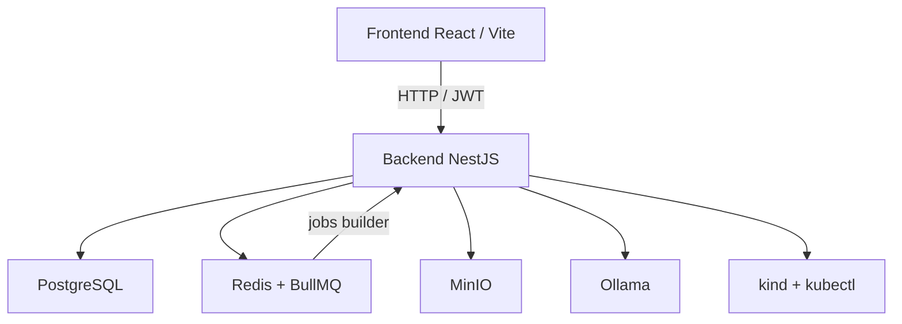

# DockUS

DockUS es una plataforma académica para gestionar proyectos, asignaciones, entregas y evaluación automática desde una consola orientada a profesorado. El repositorio contiene un backend en NestJS, un frontend en React/Vite y una infraestructura local basada en PostgreSQL, Redis, MinIO, Ollama y un clúster `kind` compartido para la ejecución del builder.

La iteración actual está enfocada en un flujo `teacher-first`: preparar el proyecto, asignar alumnado, recibir entregas, lanzar runs del builder y leer un informe técnico estructurado sin salir de la aplicación.

## Estado actual

- Backend HTTP en NestJS 11 con JWT, RBAC, TypeORM, BullMQ y OpenAPI.
- Frontend React 18 + Vite con rutas operativas para `Projects`, `Deliveries`, `Builder`, `Users` y `Storage`.
- Builder Python-first con:
  - planificación asistida por LLM,
  - autocorrección limitada de build/deploy,
  - análisis estático con `ruff` y `bandit`,
  - informe final con feedback técnico estructurado.
- Persistencia de código y suites docentes en MinIO.
- Ejecución asíncrona de runs mediante Redis + BullMQ.
- CI con build de frontend y build + tests de backend.

## Arquitectura de alto nivel



## Componentes del repositorio

| Componente | Propósito |
| --- | --- |
| [`backend/`](./backend/README.md) | API, dominio, colas, builder, storage y observabilidad. |
| [`frontend/`](./frontend/README.md) | Consola operativa para profesorado y alumnado. |
| [`docker-compose.yml`](./docker-compose.yml) | Stack local completo para desarrollo y pruebas manuales. |
| [`.github/workflows/backend-ci.yml`](./.github/workflows/backend-ci.yml) | Workflow de CI para build y test básicos. |

## Modelo funcional actual

### Dominio

- `Project`: define el proyecto académico, su estado y el máximo de entregas por alumno.
- `ProjectAssignment`: vincula proyecto y estudiante.
- `Delivery`: representa una entrega versionada de una asignación.
- `StorageObject`: guarda artefactos en MinIO, principalmente código de alumno y suite docente.
- `BuildRun`: registra una ejecución del builder asociada a una entrega.

### Flujo principal

1. Un profesor crea un proyecto.
2. Asigna estudiantes al proyecto.
3. Sube la suite docente de tests al proyecto.
4. El alumnado crea una entrega y sube su código.
5. Profesor o alumno lanza un `BuildRun` sobre la entrega.
6. El builder analiza, construye, despliega, valida y limpia.
7. El informe final queda embebido en el detalle del run.

## Builder: comportamiento real hoy

El builder no crea un clúster por proyecto. En el estado actual:

- usa un clúster `kind` compartido configurable mediante `BUILDER_KIND_CLUSTER_NAME`,
- crea un `namespace` efímero por run,
- carga la imagen Docker en ese clúster local,
- despliega `Job` o `Deployment` según la receta del planner,
- ejecuta probes, ventana de estabilidad y tests docentes,
- persiste evidencias y reporte al final del run.

Además:

- si el build o el arranque fallan por dependencias faltantes de entorno, intenta reparar la receta con un bucle acotado de self-healing;
- la revisión estática alimenta al evaluador con hallazgos de `ruff`, `bandit` y heurísticas propias;
- el frontend consume historial y detalle de runs, y sigue el timeline mediante eventos incrementales.

## Requisitos

### Requisitos mínimos

- Docker y `docker compose`
- Node.js 22 si se quiere ejecutar backend o frontend fuera de contenedores
- npm 10+

### Requisitos adicionales para usar el builder fuera de Docker Compose

- Docker daemon accesible desde el proceso backend
- `kubectl`
- `kind`
- `python3`
- `pip`
- `ruff`
- `bandit`

En la práctica, el camino más sencillo para arrancar todo el entorno es `docker compose`.

## Arranque rápido con Docker Compose

1. Copia la configuración base:

```bash
cp .env.example .env
```

2. Arranca la plataforma:

```bash
docker compose up --build
```

3. Abre los servicios principales:

- Frontend: [http://localhost:5173](http://localhost:5173)
- Backend API: [http://localhost:3000/api](http://localhost:3000/api)
- Swagger: [http://localhost:3000/api/docs](http://localhost:3000/api/docs)
- MinIO Console: [http://localhost:9001](http://localhost:9001)
- Ollama expuesto al host: `http://localhost:11435`

### Qué levanta el compose

- `postgres`
- `redis`
- `minio`
- `ollama`
- `ollama-bootstrap`
- `backend`
- `frontend`

La primera subida puede tardar más porque `ollama-bootstrap` descarga el modelo base y crea los modelos derivados para planificación y evaluación.

## Ejecución manual por separado

### Backend

```bash
cd backend
npm install
npm run start:dev
```

### Frontend

```bash
cd frontend
npm install
npm run dev
```

Si no usas Docker Compose, asegúrate de que PostgreSQL, Redis, MinIO y el tooling del builder estén disponibles y alineados con el `.env`.

## Verificación recomendada

```bash
cd backend && npm run build
cd backend && npm test -- --runInBand
cd frontend && npm run build
```

El backend compila a `backend/build`. Los tests del backend usan un wrapper que fija temporales y caché en `/tmp` en Linux para evitar problemas por rutas del host.

## CI

El workflow actual valida:

- `frontend`: `npm ci` + `npm run build`
- `backend`: `npm ci` + `npm run build` + `npm test -- --runInBand`

Archivo relevante:

- [`.github/workflows/backend-ci.yml`](./.github/workflows/backend-ci.yml)

## Estructura del repositorio

```text
DockUS/
├── backend/                # API y dominio
├── frontend/               # Consola React/Vite
├── .github/workflows/      # CI
├── docker-compose.yml      # Stack local completo
└── .env.example            # Configuración base
```

## Documentación por componente

- [Backend README](./backend/README.md)
- [Frontend README](./frontend/README.md)

## Notas importantes

- El backend aplica prefijo global `/api`.
- Swagger se expone fuera de producción.
- El builder actual está optimizado para proyectos Python.
- El reporte final se obtiene desde el detalle del run; no existe un endpoint separado de informe.
- La infraestructura descrita en el repositorio es la realmente soportada hoy; cualquier evolución hacia runtime por proyecto, clúster dedicado o streaming SSE completo debe considerarse trabajo futuro hasta que el código lo implemente.
