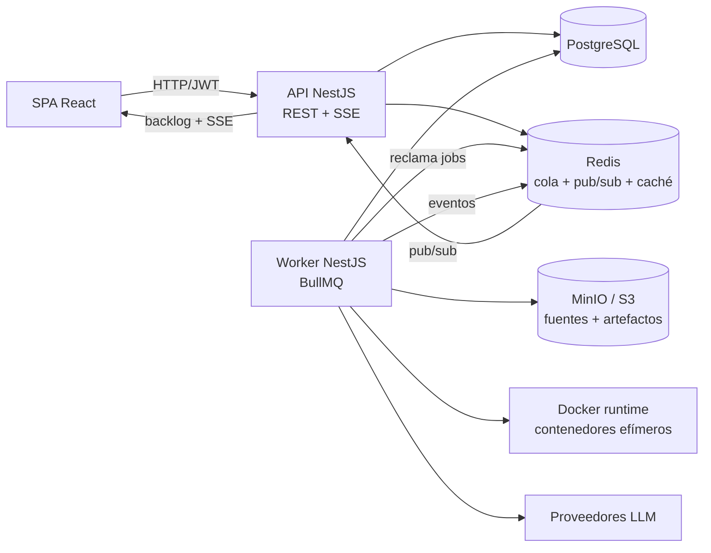

# Arquitectura del sistema

## Resumen

EduCodeAI separa la interacción HTTP del trabajo pesado. El navegador solo conoce la API; la API coordina el dominio y encola trabajos; el worker ejecuta el pipeline del Builder; y los servicios de infraestructura guardan estado, eventos, artefactos y credenciales.



La API y el worker se construyen desde el mismo backend, pero arrancan con módulos raíz y roles de proceso distintos. La API no recibe el socket de Docker; el worker es el único proceso que necesita crear y destruir contenedores de evaluación.

## Procesos y responsabilidades

| Proceso | Entrada | Responsabilidad | Dependencias críticas |
| --- | --- | --- | --- |
| API | Peticiones HTTP y conexiones SSE | Autenticación, CRUD académico, creación/cancelación de ejecuciones, lectura de estado e informes | PostgreSQL, Redis, MinIO para lecturas autorizadas |
| Worker | Jobs BullMQ `builder-runs` | Pipeline completo: workspace, runtime, Docker, IA, evaluación, informe | Redis, PostgreSQL, MinIO, Docker y proveedores LLM |
| Frontend | REST/SSE | Presentación por rol y coordinación de la experiencia de entrega | API |

`main.ts` crea la aplicación HTTP con `ApiModule`; `worker.ts` crea un contexto sin servidor HTTP con `WorkerModule`. Ambos comparten `CoreModule` e inyectan el token `PROCESS_ROLE` para que la infraestructura pueda distinguir `api` de `worker`.

## Flujo de una petición asíncrona

```text
Alumno/Docente
    │ POST /api/builder/deliveries/:deliveryId/run
    ▼
API: valida acceso y cuota → crea BuildRun(QUEUED) → commit → añade job a Redis
    │ 202 Accepted + buildRunId
    ▼
Worker: reclama job → cambia BuildRun a RUNNING → ejecuta pipeline
    │
    ├── PostgreSQL: estado, eventos, evaluación, informe y proyecciones
    ├── MinIO: fuente, suite docente y evidencias
    └── Redis pub/sub: notificación inmediata al proceso API
    ▼
API: backlog de eventos + stream SSE autorizado
    ▼
Frontend: timeline, consola, evidencias e informe final
```

No existe una llamada RPC directa entre API y worker. La coordinación se hace mediante la cola BullMQ, PostgreSQL y Redis Pub/Sub. Esto permite replicar workers sin introducir estado de sesión en memoria.

## Capas del backend

Los módulos de negocio con persistencia siguen una variante de arquitectura hexagonal:

```text
presentation/    HTTP, DTOs, guards y mapeo de respuestas
application/     casos de uso, orquestación y reglas de aplicación
domain/          entidades, tipos y puertos de repositorio
infrastructure/  TypeORM, Redis, Docker, MinIO y adaptadores externos
```

Las dependencias deben apuntar hacia dentro. El dominio no conoce TypeORM ni clientes externos; los controladores no invocan Docker ni contienen la lógica del pipeline. Las reglas se comprueban con `npm run boundaries` en [backend/.dependency-cruiser.cjs](../backend/.dependency-cruiser.cjs) y con el chequeo de puertos de repositorio.

## Mapa de módulos

| Zona | Contenido |
| --- | --- |
| `backend/src/modules/auth` y `users` | identidad, JWT, roles y permisos |
| `backend/src/modules/academic` | proyectos, asignaciones, grupos y entregas |
| `backend/src/modules/projects/builder` | ejecución, IA, runtime, eventos, informes y endpoints del Builder |
| `backend/src/health` | liveness/readiness de API, base de datos, Redis, Docker y LLM |
| `backend/src/shared/infrastructure/database` | TypeORM, migraciones y transacciones |
| `backend/src/shared/infrastructure/ai` | tipos LLM, router, adaptadores, cifrado y circuit breaker |
| `backend/src/shared/infrastructure/docker` | ejecución de contenedores y límites de recursos |
| `backend/src/shared/infrastructure/storage` | MinIO/S3 y URLs firmadas |
| `frontend/src/*` | dominios de interfaz y paneles por rol |
| `shared/contracts` | tipos puros compartidos entre backend y frontend |

## Escalado y límites

- La API y los workers pueden escalarse de forma independiente.
- Redis es el coordinador de cola y eventos, pero PostgreSQL es la fuente canónica del estado de una ejecución.
- El worker necesita acceso al daemon Docker y al mismo path de workspace que el contenedor de evaluación; ese requisito está reflejado en Compose.
- El código del alumno es entrada no confiable. El aislamiento Docker reduce el riesgo, pero el host Docker y su socket siguen siendo un límite de confianza operativo.

## Referencias de implementación

- Bootstrap HTTP: [backend/src/bootstrap.ts](../backend/src/bootstrap.ts).
- Módulos raíz: [backend/src/api.module.ts](../backend/src/api.module.ts), [backend/src/worker.module.ts](../backend/src/worker.module.ts) y [backend/src/core.module.ts](../backend/src/core.module.ts).
- Composición del Builder: [builder.module.ts](../backend/src/modules/projects/builder/builder.module.ts) y [builder-pipeline.module.ts](../backend/src/modules/projects/builder/builder-pipeline.module.ts).
- Flujo de evaluación: [pipeline.md](pipeline.md).

