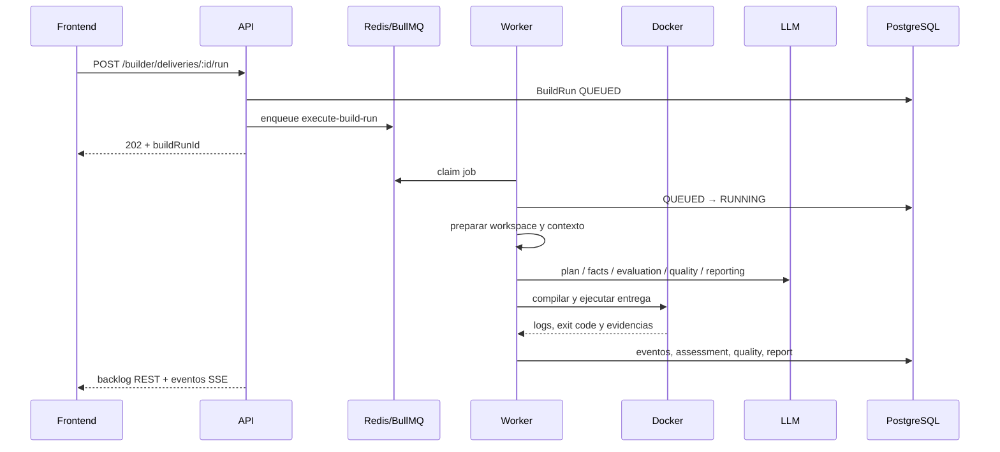

# Pipeline del Builder

El Builder transforma una entrega de código en una evaluación reproducible y un informe pedagógico. Es un proceso asíncrono: la petición que lo inicia solo crea el trabajo y devuelve un identificador; el cálculo ocurre en el worker.

## 1. Inicio y encolado

El flujo de alumno en el frontend hace lo siguiente:

1. Crea una entrega para la asignación.
2. Calcula el SHA-256 del archivo y lo sube a storage.
3. Solicita `POST /api/builder/deliveries/:deliveryId/run`.

El servicio de comandos valida el acceso, comprueba la cuota de gasto del proyecto y crea un `BuildRun` en estado `QUEUED`. El job se añade a la cola después del commit de base de datos, con el UUID de la ejecución como `jobId`. Si Redis no acepta el job, la ejecución queda marcada como fallida para no dejar un estado fantasma.

La ejecución activa de una entrega está protegida por un índice único parcial para evitar dos trabajos simultáneos `QUEUED`/`RUNNING` para la misma entrega.

## 2. Ciclo de vida en el worker

`BuilderProcessor` consume el job `execute-build-run`. `BuilderRunLifecycleService` reclama atómicamente una ejecución `QUEUED`, marca la entrega como `IN_REVIEW`, emite `RUN_STARTED` y delega en `BuilderPipelineOrchestrator`.



## 3. Las seis etapas

La preparación del workspace ocurre antes de las seis etapas. El orquestador comprueba cancelación entre pasos y limpia el workspace en un `finally`, incluso cuando una etapa lanza una excepción.

| Etapa | Entrada principal | Qué hace | Resultado |
| --- | --- | --- | --- |
| **Plan** | código, asignación y rúbrica | Pide al LLM un contrato estructurado con runtime, comandos, dependencias, tests y expectativas | plan validado + trace de prompt/respuesta |
| **Compile** | plan | `RecipeCompiler` traduce el plan a una receta portable: imagen, build, comando, stdin, tests y healthcheck | receta ejecutable o motivo explícito de no ejecución |
| **Execution** | receta y workspace | Construye/reutiliza la imagen de dependencias y ejecuta el programa en un contenedor efímero | stdout, stderr, exit code, timeout, logs y evidencias |
| **Evaluation** | hechos del código y ejecución, asignación y plan | Extrae hechos y pide la evaluación contra la rúbrica | assessment, breakdown y avisos del guard de alucinaciones |
| **Quality** | código y contexto de evaluación | Genera hallazgos de calidad en un contrato separado | hallazgos por categoría, severidad, archivo y línea |
| **Report** | assessment, ejecución, calidad y contexto pedagógico | Compone el informe v3; el LLM aporta redacción, no recalcula la nota | informe para alumno/docente + `REPORT_JSON` |

La etapa de report no puede cambiar score, status, outcome ni confidence. El feedback determinista se genera a partir de la ejecución y el LLM se usa para narrativa y copia pedagógica.

## 4. Workspace, runtime y ejecución

`BuilderWorkspaceService` descarga desde MinIO la entrega del alumno y la suite docente más reciente. Extrae ZIP/TAR.GZ con límites de entradas, tamaño, path seguro y tipos de archivo; la suite se mantiene separada del código del alumno y se monta en `.educodeai/teacher-tests` como solo lectura.

En proyectos CLI, `BuilderRecipeCompiler` reconoce los entrypoints estables `run_suite.sh` (C) y `run_suite.py` (Python) de esa ruta y los incorpora a la receta. La suite sustituye la ejecución sin entrada del CLI y su resultado queda marcado como evidencia de suite aprobada o fallida. Los servicios y las suites sin esos entrypoints mantienen la receta inferida normalmente.

`SourceCodePayloadBuilder` aplica una whitelist de extensiones y nombres de archivos, excluye directorios como `node_modules`, `.git`, `venv`, `dist`, `build` y `target`, y limita el tamaño enviado a prompts.

El catálogo actual reconoce Python, C y Node.js. Python y C pueden producir una receta ejecutable; Node se detecta, pero el catálogo actual no lo ejecuta como runtime principal. Si un runtime o plan no es soportado, Compile deja constancia de la razón en vez de inventar un comando.

Los contenedores de ejecución se lanzan con medidas de defensa en profundidad configurables: `networkMode: none`, root filesystem de solo lectura, usuario no privilegiado, límites de CPU/memoria/PIDs, `HOME=/tmp` y timeout. Un exit code distinto de cero del programa es evidencia de la entrega; un fallo del daemon Docker o de la infraestructura es un error del run.

## 5. Estados y persistencia

```text
QUEUED ──▶ RUNNING ──▶ SUCCESS
   │          │
   │          ├──────▶ FAILED
   │          └──────▶ CANCELLED
   └─────────────────▶ CANCELLED
```

Los estados son los definidos por los contratos compartidos: `QUEUED`, `RUNNING`, `SUCCESS`, `FAILED` y `CANCELLED`. `BuildRun` conserva timestamps, warnings, costes/tokens, evaluación, quality findings, informe y `latestEventSequence`. `BuildRunEvent` conserva el historial ordenado; los artefactos grandes o sensibles se guardan en MinIO con metadatos en PostgreSQL.

La persistencia final se hace con una condición sobre el estado `RUNNING` para no sobrescribir una cancelación concurrente. Un run terminado no se vuelve a ejecutar por reentrega accidental del mismo job.

## 6. Eventos y seguimiento en vivo

Los eventos importantes son:

| Evento | Significado |
| --- | --- |
| `RUN_ENQUEUED` | se aceptó el trabajo |
| `RUN_STARTED` | un worker reclamó la ejecución |
| `RUN_STATUS_CHANGED` | cambió el estado |
| `LOG_CHUNK` | llegó una porción de stdout/stderr |
| `WARNING_ADDED` | la ejecución continúa con una degradación o advertencia |
| `ARTIFACT_ADDED` | existe una evidencia o artefacto consultable |
| `REPORT_READY` | el informe v3 está disponible |
| `RUN_COMPLETED`, `RUN_FAILED`, `RUN_CANCELLED` | estado terminal |

El worker guarda el evento en PostgreSQL y publica por Redis. La API carga primero un backlog y después abre el stream SSE; el parámetro `afterSequence` permite reconectar sin perder eventos. El frontend vuelve a pedir backlog, fusiona por id/secuencia y deja de reconectar al recibir un evento terminal.

## 7. Cancelación y recuperación

- La base de datos es la fuente de verdad para cancelar: el cambio de estado es atómico.
- Redis mantiene una clave de cancelación como vía rápida; si no responde, el worker consulta PostgreSQL.
- El orquestador comprueba cancelación entre etapas y el watcher puede abortar la ejecución Docker mediante `AbortSignal`.
- Al iniciar y periódicamente, el worker detecta runs `RUNNING` obsoletos y jobs inconsistentes. Los jobs confirmados como pendientes pueden reencolarse; un estado de Redis indeterminado se deja intacto para evitar duplicados.
- La limpieza del workspace es best effort y no modifica el resultado ya persistido.

## Referencias de implementación

- Orquestación: [builder-pipeline-orchestrator.service.ts](../backend/src/modules/projects/builder/application/services/orchestration/builder-pipeline-orchestrator.service.ts).
- Ciclo de vida y cola: [builder-run-lifecycle.service.ts](../backend/src/modules/projects/builder/application/services/orchestration/builder-run-lifecycle.service.ts) y [builder-run-commands.service.ts](../backend/src/modules/projects/builder/application/services/orchestration/builder-run-commands.service.ts).
- Etapas: [services/stages](../backend/src/modules/projects/builder/application/services/stages).
- Runtime y workspace: [builder-recipe-compiler.service.ts](../backend/src/modules/projects/builder/application/services/compilation/builder-recipe-compiler.service.ts), [builder-workspace.service.ts](../backend/src/modules/projects/builder/application/services/workspace/builder-workspace.service.ts) y [docker-execution.service.ts](../backend/src/shared/infrastructure/docker/docker-execution.service.ts).
- Eventos: [builder-run-events.service.ts](../backend/src/modules/projects/builder/infrastructure/events/builder-run-events.service.ts).
